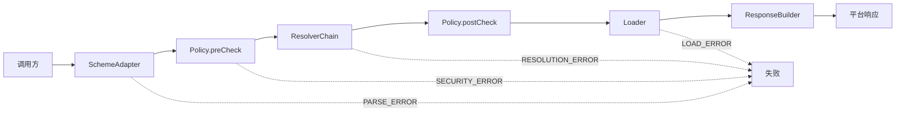
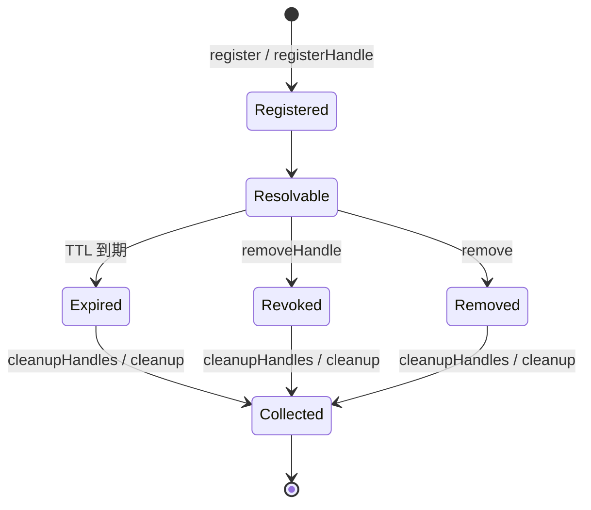

# LocalAsset

协议无关的客户端资源解析引擎，用于在 WebView 与 Native 之间建立统一、安全、**可回溯**的资源访问机制。

## 目录

1. [这是什么 / 不是什么](#1-这是什么--不是什么)
2. [要解决的问题](#2-要解决的问题)
3. [LocalAsset 的解决方式](#3-localasset-的解决方式)
4. [核心链路](#4-核心链路)
   - [4.1 核心设计原则](#41-核心设计原则)
   - [4.2 句柄注册表（核心卖点）](#42-句柄注册表核心卖点)
   - [4.3 两条注册路径，两套安全模型](#43-两条注册路径两套安全模型重要)
   - [4.4 资源生命周期](#44-资源生命周期)
5. [项目结构](#5-项目结构)
6. [平台支持](#6-平台支持)
7. [快速开始](#7-快速开始)
   - [7.1 让 FilePath 资源可解析（安全默认）](#71-让-filepath-资源可解析安全默认)
8. [文档索引](#8-文档索引)
9. [License](#9-license)

---

## 1. 这是什么 / 不是什么

LocalAsset 是**运行时资源的句柄层（handle layer）**：把"拍照、下载、动态生成"等运行时产生的资源，注册成一个可过期、可撤销、可按作用域隔离的 `local-asset://` URI，再交给 H5 或 Native 通过这条 URI 回溯访问。

- **不是** 打包静态资源（assets/res）的 Web 服务器 —— 那是 Android `WebViewAssetLoader` / iOS `WKURLSchemeHandler` 原生能力该做的事，别用 LocalAsset 替代它们。
- **是** `WebViewAssetLoader` 不覆盖的那一层：给 H5 一个**能追溯回来源、能吊销、会过期**的资源 URI，并跨 Android/iOS/HarmonyOS 保持一致语义。

适用场景：内嵌 WebView 的混合应用，需要在 H5 与 Native 之间流转**运行时动态资源**（相机预览、临时下载、生成的图片/PDF、登录态凭证资源等）。

## 2. 要解决的问题

- **URL 不可逆** — 动态生成的资源 URL 无法追溯到来源，生命周期管理和清理困难。LocalAsset 用句柄注册表（`HandleRegistry`）让每个 URI 可回溯、可撤销。
- **访问不稳定** — H5 依赖 `file://` 或平台 hack 访问运行时资源，随系统版本/WebView 实现频繁出问题。统一走 `local-asset://` 自定义 scheme。
- **语义分叉** — Android/iOS/HarmonyOS 对资源访问的抽象不同，导致难以排查的行为差异。LocalAsset 用共享测试夹具（`docs/compatibility-fixtures/`）卡住三端行为一致。
- **缺乏默认安全** — 没有统一访问层时，路径穿越、跨作用域泄漏、越权访问容易被引入。LocalAsset 在解析前后各插一道策略门（pre/post check）。

## 3. LocalAsset 的解决方式

LocalAsset 在调用方（WebView 或 Native）与资源（内存数据、文件）之间充当结构化中间层：

1. 将自定义 scheme URL（`local-asset://`）解析为标准化请求模型
2. 在任何解析动作之前执行 **pre-check** 安全策略
3. 通过有序 **resolver 链** 路由请求 —— 首个命中即返回
4. 对解析出的描述符执行 **post-check** 安全策略
5. 从解析出的来源加载原始字节数据
6. 通过平台特定的响应构建器返回结果

## 4. 核心链路



### 4.1 核心设计原则

- **实例作用域** — 无全局单例。每个 `LocalAsset` 引擎通过 `LocalAsset.Builder()` 独立构建，实例间状态隔离。
- **两阶段策略校验** — `preCheck` 在解析前校验请求级合法性；`postCheck` 在解析命中后、加载前校验资源级安全性（TTL / 作用域 / 文件根 / 来源类型）。两阶段均为强制，不可绕过。
- **描述符/数据分离** — `ResourceDescriptor` 回答"资源是什么、来自哪里"；`ResourceData` 是加载后的实际数据。两者生命周期独立。
- **Resolver 短路** — 首个返回 `Hit` 或 `Failure` 的 resolver 终止链路；`Skip` 传递到下一个 resolver。
- **错误分类** — 所有失败归入四类之一：`PARSE_ERROR`、`RESOLUTION_ERROR`、`LOAD_ERROR`、`SECURITY_ERROR`，并标记发生的链路阶段。

### 4.2 句柄注册表（核心卖点）

`HandleRegistry` 是 LocalAsset 区别于静态资源服务器的关键：

- `registerHandle(handle)` 返回一个不透明的 `local-asset://handles/.../<token>/<fileName>` URI，把它交给 H5 当作一个**能力凭证（capability）**。
- `resolveHandle(uri)` 把 URI 回溯到原始字节、文件名、MIME、元数据；过期或未知 URI 抛 `RESOLUTION_ERROR`（凭证失效是异常，不是普通分支）。
- `removeHandle(uri)` 显式吊销；`cleanupHandles()` 周期回收过期句柄；读时惰性过期。

### 4.3 两条注册路径，两套安全模型（重要）

LocalAsset 有两条注册路径，对应**两套不同的访问控制模型**，不要混为一谈：

| 路径 | 注册方式 | 安全模型 | postCheck |
|------|---------|---------|-----------|
| **Handle 路径**（运行时动态资源，主推） | `registerHandle(...)` → `local-asset://handles/<token>/<file>` | **能力令牌（capability）** —— 持有不透明 token 即等于授权；token 不可猜测、可吊销、会过期 | descriptor 的 `scope = null`、`ttlMillis = null`，postCheck 的 scope 门与 TTL 门**整体跳过**；TTL/吊销由 `HandleRegistry` 在 lookup 时自己执行 |
| **Registry 路径**（注册时已知归属的描述符） | `register(ResourceDescriptor)` | **namespace/scope 模型** —— `descriptor.namespace` 必须等于请求上下文对应作用域的 id，否则 postCheck 报 `SECURITY_ERROR` | 走 TTL / scope / source-type / 文件根 全部门禁 |

Registry 路径的 scope/namespace 耦合规则：

| scope | 可解析条件 |
|------|-----------|
| `ENGINE` | `context.engineScope == descriptor.namespace` |
| `PAGE` | `context.pageScope == descriptor.namespace` |
| `SESSION` | `context.sessionScope == descriptor.namespace` |
| `null` | 无作用域约束（任意上下文可解析） |

即 Registry 路径下 `namespace` 既是请求路由身份，又是作用域绑定 key —— 注册 PAGE 级资源时，`namespace` 应填入页面 id。**Handle 路径不受此约束**，靠不可伪造的 token 保证安全。

两条路径仍共享 preCheck（scheme/namespace 格式、路径穿越）与 postCheck 的 source-type / 文件根 校验。详见 [docs/design.md §5.4](docs/design.md)。

### 4.4 资源生命周期



资源按明确的生命周期流转：注册后进入可解析状态；TTL 过期、显式撤销或移除后不可解析；惰性/周期性清理回收。

## 5. 项目结构

```text
localasset/
├── android/                    # Android 实现（Kotlin）
│   ├── localasset-core/        #   纯 Kotlin 引擎，零 Android 框架依赖
│   ├── localasset-webview/     #   WebView 桥接层，集成 WebResourceResponse
│   └── sample/                 #   示例应用，含 8 个演示场景
├── ios/                        # iOS 实现（Swift, SPM）
│   ├── localasset-core/        #   纯 Swift 引擎，零 UIKit 依赖
│   ├── localasset-webview/     #   WKWebView 桥接层（WKURLSchemeHandler）
│   └── sample/                 #   Xcode 示例项目，含 8 个演示场景
├── harmony/                    # HarmonyOS 实现（ArkTS）
│   ├── localasset-core/        #   纯 ArkTS 引擎，零 ArkUI/ArkWeb 依赖
│   ├── localasset-webview/     #   ArkWeb 桥接层（WebSchemeHandler）
│   └── sample/                 #   演示应用，含 8 个演示场景
├── docs/                       # 设计文档与跨平台规范
│   ├── design.md               #   平台无关的产品设计参考
│   ├── compatibility.md        #   跨平台行为一致性规范
│   └── compatibility-fixtures/ #   共享测试夹具
└── README.md
```

## 6. 平台支持

| 平台 | 状态 | 文档 |
|------|------|------|
| Android | 稳定 | [android/README.md](android/README.md) |
| iOS | 稳定（core 行为与 Android 对齐；webview 桥接已覆盖 scheme handler 测试，与 Android 对齐 `onFailure`/CORS） | [ios/README.md](ios/README.md) |
| HarmonyOS | 新增（core 行为与 Android/iOS 对齐；桥接层决策逻辑已覆盖单测；sample 真机人工验收已完成 6/8 条 flow，§13.5/§13.8 未走完，见 [docs/compatibility.md §13.10](docs/compatibility.md#1310-当前验收状态)） | [harmony/README.md](harmony/README.md) |

HarmonyOS 侧存在若干已登记的平台差异，接入前请先读 [harmony/README.md](harmony/README.md) 的「与 Android/iOS 的已知差异」——其中**文件根校验无法消解符号链接**与安全直接相关。Handle token 熵源使用系统 CSPRNG（`@ohos.security.cryptoFramework`），真机上 CSPRNG 不可用时默认抛错而非静默降级（仅测试沙箱显式放行 `Math.random()` 回退）。

## 7. 快速开始

各平台的构建指令与使用示例参见对应 README：

- [Android 快速开始](android/README.md)
- [iOS 快速开始](ios/README.md)
- [HarmonyOS 快速开始](harmony/README.md)

H5 / Web 前端开发者请阅读 [Web 侧集成指南](docs/web-integration.md)。

### 7.1 让 FilePath 资源可解析（安全默认）

默认策略 `DefaultPolicy` 对 `FilePath` 来源**默认 fail-closed**：未配置允许的文件根时，所有文件路径资源都会在 `postCheck` 被拒（`file source is outside allowed roots`）。这是刻意的安全默认。要启用文件资源，在 Builder 上声明允许的根目录：

```kotlin
val localAsset = LocalAsset.Builder()
    .addAllowedFileRoot(cacheDir)   // 允许缓存目录下的文件
    .addAllowedFileRoot(filesDir)   // 允许应用文件目录
    .build()
```

`addAllowedFileRoot` 只在使用默认 `DefaultPolicy` 时生效；若通过 `policy()` 注入了自定义 `Policy`，该配置被忽略（自定义策略自行约束）。

## 8. 文档索引

| 文档 | 说明 |
|------|------|
| [docs/design.md](docs/design.md) | 产品层架构、数据模型、安全模型、设计原则、MVP 范围 |
| [docs/web-integration.md](docs/web-integration.md) | Web 侧集成指南：H5 页面如何使用 `local-asset://` URI、缓存击穿、错误处理、JSBridge 交互 |
| [docs/compatibility.md](docs/compatibility.md) | 跨平台行为一致性测试用例，约束 Android/iOS/HarmonyOS 语义一致 |
| [docs/threat-model.md](docs/threat-model.md) | 威胁模型：信任边界、攻击面、已防御/未防御项、调用方安全责任 |
| [docs/compatibility-fixtures/](docs/compatibility-fixtures/) | 跨平台共享 JSON 测试夹具 |
| [CONTRIBUTING.md](CONTRIBUTING.md) | 贡献指南：开发环境、构建测试、代码风格、发布流程 |

## 9. License

Apache 2.0
