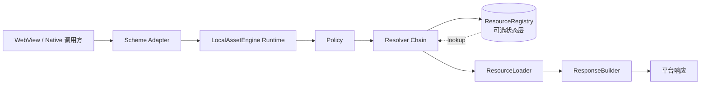
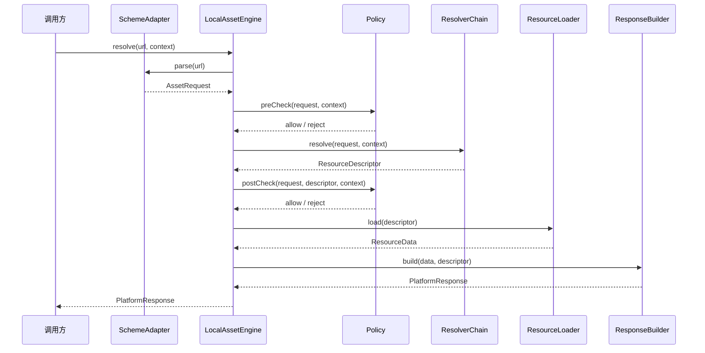
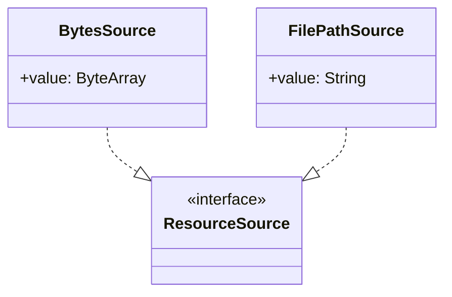
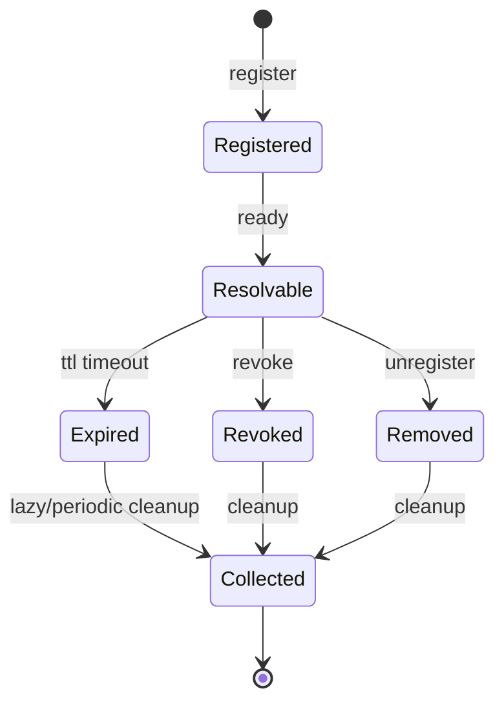

# LocalAsset 设计文档

本文档定义 LocalAsset 的产品层架构、核心模型、设计原则与安全模型。平台实现细节请参考对应平台的 README。

## 目录

1. [产品定位](#1-产品定位)
   - [1.1 产品目标](#11-产品目标)
   - [1.2 非目标](#12-非目标)
2. [核心架构](#2-核心架构)
   - [2.1 分层结构](#21-分层结构)
   - [2.2 请求流程](#22-请求流程)
   - [2.3 组件职责契约](#23-组件职责契约)
3. [设计原则](#3-设计原则)
   - [3.1 实例作用域（Instance-Scoped）](#31-实例作用域instance-scoped)
   - [3.2 两阶段策略（Two-Phase Policy）](#32-两阶段策略two-phase-policy)
   - [3.3 描述符/数据分离（Descriptor/Data Separation）](#33-描述符数据分离descriptordata-separation)
   - [3.4 解析器短路（Resolver Short-Circuiting）](#34-解析器短路resolver-short-circuiting)
   - [3.5 错误分类](#35-错误分类)
4. [核心模型](#4-核心模型)
   - [4.1 AssetRequest（请求模型）](#41-assetrequest请求模型)
   - [4.2 ResolveContext（解析上下文）](#42-resolvecontext解析上下文)
   - [4.3 ResourceDescriptor（资源描述符）](#43-resourcedescriptor资源描述符)
   - [4.4 ResourceSource（资源来源）](#44-resourcesource资源来源)
5. [安全模型](#5-安全模型)
   - [5.1 默认安全](#51-默认安全)
   - [5.2 校验维度](#52-校验维度)
   - [5.3 Scope 隔离](#53-scope-隔离)
   - [5.4 两条注册路径，两套安全模型](#54-两条注册路径两套安全模型)
   - [5.5 默认 fail-closed](#55-默认-fail-closed)
6. [资源生命周期](#6-资源生命周期)
7. [跨平台一致性](#7-跨平台一致性)
8. [可观测性](#8-可观测性)
9. [MVP 范围与演进](#9-mvp-范围与演进)
   - [9.1 MVP 交付物](#91-mvp-交付物)
   - [9.2 MVP 不包含](#92-mvp-不包含)
   - [9.3 V1+ 演进预留](#93-v1-演进预留)
10. [术语表](#10-术语表)

---

## 1. 产品定位

LocalAsset 是协议无关的客户端资源解析引擎，用于在 WebView 与 Native 之间建立统一、安全、可回溯的资源访问机制。

### 1.1 产品目标

- 统一资源请求模型，消除平台差异
- 支持「注册资源」与「规则解析」两类扩展方式并行
- 提供默认安全模型（校验、隔离、访问控制）
- 保持跨平台语义一致
- 提供从 URL 到资源描述的可逆追溯路径

### 1.2 非目标

- 不替代通用文件服务、CDN 或远程同步系统
- MVP 阶段不引入完整声明式规则引擎
- 不在本文档冻结具体平台实现细节

## 2. 核心架构

### 2.1 分层结构

### 2.2 请求流程

### 2.3 组件职责契约

| 组件 | 职责 | 禁止 |
|------|------|------|
| `LocalAssetEngine` | 编排完整链路：parse → preCheck → resolve → postCheck → load → build | 不直接执行解析或加载逻辑 |
| `SchemeAdapter` | URL 标准化为 `AssetRequest` | 不做安全判断、不做资源映射 |
| `ResourceResolver` | 将请求映射为 `ResourceDescriptor` | 不读取资源数据 |
| `ResourceRegistry` | 注册状态存储与查询 | 不执行解析策略 |
| `Policy` | 安全与访问控制决策 | 不影响 resolver 命中逻辑 |
| `ResourceLoader` | 从 `ResourceSource` 读取数据 | 不关心资源来源与语义 |
| `ResponseBuilder` | 将引擎结果转换为平台响应 | 不做资源决策 |

## 3. 设计原则

### 3.1 实例作用域（Instance-Scoped）

每个 `LocalAsset` 引擎通过 `Builder` 独立构建，禁止全局静态单例。不同引擎实例之间状态隔离，避免生命周期污染和测试相互影响。

### 3.2 两阶段策略（Two-Phase Policy）

- **preCheck** — 请求级校验：在 resolver 执行前，校验 URL 合法性、namespace 安全性等
- **postCheck** — 资源级校验：在 resolver 命中后、loader 执行前，校验 TTL、scope、source type、文件路径安全性

两阶段均为强制，不可绕过。

### 3.3 描述符/数据分离（Descriptor/Data Separation）

- `ResourceDescriptor`：描述资源的元信息（id、type、source、mimeType、TTL、scope）
- `ResourceData`：实际加载的字节数据

两者生命周期独立，决策与加载解耦。

### 3.4 解析器短路（Resolver Short-Circuiting）

Resolver 链按注册顺序执行：
- 首个返回 `Hit` → 立即返回，后续 resolver 不执行
- 返回 `Skip` → 继续下一个 resolver
- 返回 `Failure` → 立即终止，进入错误处理

默认链顺序：`HandleRegistryResolver`（始终首位，处理 Handle-Backed URI 反查）→ 用户注册的 resolver → `RegistryResolver`（默认兜底）。

### 3.5 错误分类

所有失败归入四类之一，且标记发生阶段：

| 分类 | 含义 | 典型触发场景 |
|------|------|-------------|
| `PARSE_ERROR` | URL 无法解析 | 非法 scheme、格式错误 |
| `RESOLUTION_ERROR` | 无 resolver 命中 | 资源未注册、已过期、已移除 |
| `LOAD_ERROR` | 数据读取失败 | 文件不存在、字节读取异常 |
| `SECURITY_ERROR` | 安全策略拒绝 | namespace 非法、scope 不匹配、路径穿越 |

## 4. 核心模型

### 4.1 AssetRequest（请求模型）

引擎内部的标准化请求模型，承载统一路由语义。

| 字段 | 类型 | 说明 |
|------|------|------|
| `scheme` | String | 协议标识 |
| `namespace` | String | 命名空间 |
| `identifier` | String? | 资源标识符 |
| `path` | String? | 资源路径 |
| `query` | Map | 查询参数 |
| `fragment` | String? | 片段标识 |
| `metadata` | Map | 扩展元数据 |

约束：`identifier` 与 `path` 至少一个有效；字段保持平台中立。

### 4.2 ResolveContext（解析上下文）

影响解析决策的运行时上下文信息。

| 字段 | 类型 | 说明 |
|------|------|------|
| `engineScope` | String? | 引擎实例标识 |
| `callerScope` | String? | 调用方标识 |
| `pageScope` | String? | 页面标识 |
| `sessionScope` | String? | 会话标识 |
| `requestMetadata` | Map | 请求级扩展数据 |

约束：平台可置空未支持字段，但语义字段不可移除。

### 4.3 ResourceDescriptor（资源描述符）

解析命中后的统一资源描述，回答"资源是什么、来自哪里"。

| 字段 | 类型 | 说明 |
|------|------|------|
| `id` | String | 唯一标识，需可回溯 |
| `namespace` | String | 命名空间 |
| `type` | ResourceType | STATIC / DYNAMIC |
| `source` | ResourceSource | BytesSource 或 FilePathSource |
| `mimeType` | String? | MIME 类型 |
| `createdAtMillis` | Long | 创建时间戳 |
| `ttlMillis` | Long? | 有效期（null 表示无 TTL 约束） |
| `scope` | ResourceScope? | ENGINE / PAGE / SESSION |

### 4.4 ResourceSource（资源来源）

## 5. 安全模型

### 5.1 默认安全

安全策略不可选配。即使调用方未显式配置 Policy，引擎也注入默认安全策略。

### 5.2 校验维度

| 阶段 | 校验内容 |
|------|---------|
| preCheck | scheme 合法性、namespace 白名单、identifier/path 格式、请求参数合法性 |
| postCheck | TTL 是否过期、scope 是否匹配、source type 是否允许、文件路径是否安全（禁止绝对路径、路径穿越、不可信外部存储） |

### 5.3 Scope 隔离

资源可按 scope 限定可见范围：
- `ENGINE` — 仅当前引擎实例可见
- `PAGE` — 仅创建页面可见
- `SESSION` — 仅当前会话可见

跨 scope 访问归类为 `SECURITY_ERROR`。

默认实现中，scope 身份通过 `descriptor.namespace` 与 `ResolveContext` 对应字段是否相等来判定：`scope = ENGINE` 时要求 `namespace == engineScope`，`scope = PAGE` 时要求 `namespace == pageScope`，`scope = SESSION` 时要求 `namespace == sessionScope`。调用方需要在构造 resolver 命中的 `ResourceDescriptor` 时把 `namespace` 设为对应的 scope 身份令牌，并在 `ResolveContext` 中传入相同的值，两阶段策略才能正确放行；未设置 `scope` 的 descriptor 不受此约束。

### 5.4 两条注册路径，两套安全模型

LocalAsset 有两条注册路径，对应两套不同的访问控制模型，**不可混为一谈**：

| 路径 | 注册方式 | 访问控制模型 | postCheck 行为 |
|------|---------|-------------|----------------|
| **Registry 路径** | `LocalAsset.register(ResourceDescriptor)` | **namespace/scope 模型** —— 通过 `descriptor.namespace` 与 `ResolveContext` 的 scope 身份匹配来授权（见 §5.3） | 走 TTL / scope / source-type / 文件根 全部门禁 |
| **Handle 路径** | `LocalAsset.registerHandle(ResourceHandle)` → `local-asset://handles/<token>/<fileName>` | **能力令牌模型（capability）** —— 持有不透明 token 即等于授权，token 不可猜测、可吊销、会过期 | `HandleRegistryResolver` 返回的 descriptor **显式 `scope = null`、`ttlMillis = null`**，postCheck 的 scope 门与 TTL 门对其**整体跳过**；但 **source-type / 文件根门照常适用**——`ResourceHandle` 现支持 `Bytes` 与 `FilePath` 两种来源，file-backed handle 的路径必须落在 `addAllowedFileRoot` 声明的根内，否则 postCheck 拒绝（`SECURITY_ERROR`），即能力令牌无法越出允许根 |

设计意图：

- **Handle 路径**面向运行时动态资源（相机预览、临时下载、生成的图片/PDF）。这类资源的访问凭证是注册时返回的不透明 URI 本身——能拿到 URI 即有权读取，因此不需要再做 namespace/scope 匹配；TTL 与吊销由 `HandleRegistry` 自己在 lookup 时惰性/显式执行，不重复走 postCheck 的绝对时间 TTL 判定（否则会因为 descriptor 的 `createdAtMillis` 是占位 0 而全部判过期）。
- **Registry 路径**面向注册时即已知 namespace/scope 归属的描述符，需要按引擎/页面/会话作用域隔离访问。

⚠️ **常见误解**：把 §5.3 的 namespace/scope 耦合当成 LocalAsset 的全部安全语义。它只作用于 Registry 路径；Handle 路径靠不可伪造的 token + HandleRegistry 的过期/吊销来保证安全。两条路径仍共享 preCheck（scheme/namespace 格式、路径穿越）与 postCheck 的 source-type / 文件根 校验。

⚠️ **平台实现现状**：Android 用 `UUID.randomUUID()`（内部 `SecureRandom`）、iOS 用 `UUID()`，均为密码学随机源，满足上表「token 不可猜测」的要求。**HarmonyOS 优先使用 `@ohos.security.cryptoFramework` CSPRNG**；本地单元测试沙箱中 `cryptoFramework.generateRandomSync` 返回空 data 时**默认抛 `Error`（fail-loud）**，仅经显式开关 `allowInsecureRandomFallbackForTests(true)` 放行后才回退 `Math.random()`——真机上满足 CSPRNG 要求，且 CSPRNG 异常不会无声退化为可预测值。见 `harmony/README.md`「handle token 熵源」。

此外，三端默认**不发送 CORS 头**（`Access-Control-Allow-Origin` 缺省），``/`<link>`/`<script>` 不经 CORS 仍可引用子资源；`fetch()`/`XHR` 需集成方通过 `allowedOrigins` 显式放行。这避免能力令牌经 `document.referrer` / `Referer` / `performance.getEntriesByType('resource')` 泄漏后被人通配 CORS 读走。见 `docs/threat-model.md` §3.4。

### 5.5 默认 fail-closed

`DefaultPolicy` 对 `FilePath` 来源默认拒绝：未通过 `Builder.addAllowedFileRoot` 声明允许的文件根时，所有 `FilePath` descriptor 都会在 postCheck 被拒（"file source is outside allowed roots"）。这是刻意的安全默认，避免运行时路径穿越与越权文件访问。`Bytes` 来源默认放行。注入自定义 `Policy` 时，`Builder` 上的 `addAllowedFileRoot` / `addAllowedNamespace` / `addAllowedScheme` 配置被忽略，由自定义 `Policy` 自行约束。

## 6. 资源生命周期

- **Registered** — 已注册但尚未激活
- **Resolvable** — 可被正常解析
- **Expired** — TTL 过期，不可解析但尚未物理清理
- **Revoked** — 被显式撤销
- **Removed** — 被移除
- **Collected** — 已物理清理，生命周期结束

关键约束：资源过期后即使 cleanup 尚未执行，访问结果仍视为过期，不允许因未物理删除而继续读取。

## 7. 跨平台一致性

跨平台（Android/iOS/HarmonyOS）语义一致性是核心非功能需求：

- 相同 URL 输入 → 语义一致的 `AssetRequest`
- Resolver 顺序与短路行为一致
- Registry 对 `hit/missing/expired` 的内部区分一致
- 错误分类一致：`parse_error` / `resolution_error` / `load_error` / `security_error`
- TTL 行为一致

详细测试用例见 [compatibility.md](compatibility.md)。

## 8. 可观测性

引擎每次请求至少内部记录：

- Adapter 命中情况
- Resolver 执行顺序与各 resolver 决策
- Policy 决策（通过/拒绝，及拒绝阶段）
- Descriptor id 或关键标识
- Source 类型
- 错误阶段与错误类别

## 9. MVP 范围与演进

### 9.1 MVP 交付物

- 实例化 engine runtime
- 多 adapter 支持
- 有序 resolver chain
- In-memory registry
- Descriptor/load 分离
- 基础 policy（两阶段校验 + scope 隔离）
- 基础错误分类
- 平台 response 适配边界
- Handle-Backed URI 注册与反查

### 9.2 MVP 不包含

- 完整声明式规则引擎
- 远程规则下发
- 多层缓存平台
- 调试控制台/可视化检查器
- 通用远程资源平台能力

### 9.3 V1+ 演进预留

- 更丰富的 `ResolveContext`
- Resolver 优先级与分组
- Policy 组合
- 定时 cleanup
- 内置 pattern/computed resolver
- 结构化 trace 输出
- `ResourceResolver`/`ResourceLoader` 的协程/异步扩展点——当前两者均为同步阻塞签名，天然异步的数据源（网络预取缓存、Room/DataStore 等）只能通过 `runBlocking` 接入，属于已知架构缺口而非本次 MVP 范围内的缺陷
- HarmonyOS 侧尚未实现 `ResourceSource.Stream` / `ResourceData.Stream` / `AsyncResourceLoader`：ArkTS 无对等的可复用惰性流抽象，文件资源为 `fs.readSync` 同步整读（大文件会被一次性完整读入内存），`Bytes`/`FilePath` 两种来源即为该平台的完整来源集合
- `ResourceHandle` 的 `Stream` 变体：`Bytes` 与 `FilePath` 两种来源已覆盖（FilePath 让大文件无需整读进内存即可作为 capability 暴露，文件由 `FileResourceLoader` 在 resolve 时按需读取）；`Stream` 变体留待 V1+ 评估——若需对接天然异步的惰性数据源，需先解决上一条所述的同步签名扩展点

## 10. 术语表

| 术语 | 定义 |
|------|------|
| `resolve` | 从 `AssetRequest + ResolveContext` 到 `ResourceDescriptor` |
| `load` | 从 `ResourceDescriptor` 到 `ResourceData` |
| `hit` | 返回可加载的 `ResourceDescriptor` |
| `missing` | 无匹配资源或规则 |
| `expired` | 存在资源记录但已过期 |
| `skip` | resolver 放弃处理（无副作用） |
| `reject` | policy 拒绝访问（归类 `security_error`） |
| `preCheck` | 请求级策略校验 |
| `postCheck` | 资源级策略校验 |
