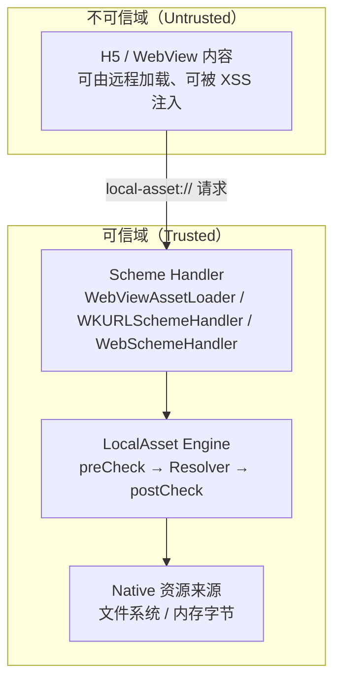

# LocalAsset 威胁模型

本文档描述 LocalAsset 的信任边界、攻击面、已防御与未防御项，以及调用方的安全责任。

## 目录

1. [信任边界](#1-信任边界)
2. [攻击面](#2-攻击面)
   - [2.1 URI 构造攻击](#21-uri-构造攻击)
   - [2.2 文件系统访问攻击](#22-文件系统访问攻击)
   - [2.3 作用域越权攻击](#23-作用域越权攻击)
3. [已防御项](#3-已防御项)
   - [3.1 强制两阶段策略校验](#31-强制两阶段策略校验)
   - [3.2 fail-closed 默认与 opt-in 白名单的边界](#32-fail-closed-默认与-opt-in-白名单的边界)
   - [3.3 能力令牌不可伪造](#33-能力令牌不可伪造)
   - [3.4 CORS 默认不暴露响应体](#34-cors-默认不暴露响应体)
   - [3.5 实例隔离](#35-实例隔离)
   - [3.6 资源生命周期管控](#36-资源生命周期管控)
4. [未防御 / 部分防御项](#4-未防御--部分防御项)
   - [4.1 HarmonyOS 符号链接逃逸 ⚠️](#41-harmonyos-符号链接逃逸-️)
   - [4.2 HarmonyOS 沙箱中 token 可预测（已 fail-loud）⚠️](#42-harmonyos-沙箱中-token-可预测已-fail-loud️)
   - [4.3 无速率限制](#43-无速率限制)
   - [4.4 无资源大小限制](#44-无资源大小限制)
   - [4.5 错误信息泄漏](#45-错误信息泄漏)
5. [调用方安全责任](#5-调用方安全责任)
6. [安全变更日志](#6-安全变更日志)

---

## 1. 信任边界

**核心信任假设**：H5 页面内容是不可信的——它可能被 XSS 注入、可能加载了第三方脚本、可能被中间人篡改。所有来自 H5 的 `local-asset://` 请求都必须经过 LocalAsset 引擎的安全校验。

## 2. 攻击面

### 2.1 URI 构造攻击

攻击者（恶意 H5 或注入脚本）可以构造任意 `local-asset://` URI，尝试：

| 攻击 | 手法 | LocalAsset 防御 |
|------|------|---------------|
| 路径穿越 | `local-asset://x/../../../etc/passwd` | preCheck 拒绝含 `..` 段的路径 |
| 未知 scheme | `local-asset://x/...` 但 scheme 被篡改 | preCheck 校验 scheme 格式 |
| namespace 探测 | 枚举 namespace 尝试发现已注册资源 | postCheck scope 门拒绝跨作用域访问（Registry 路径） |
| handle 猜测 | 枚举 token 尝试访问他人注册的 handle | token 不可猜测（CSPRNG，Android/iOS/HarmonyOS 真机） |
| 过期 handle 重放 | 使用已过期的 `local-asset://handles/...` URI | HandleRegistry lookup 时惰性过期检查 |

### 2.2 文件系统访问攻击

| 攻击 | 手法 | LocalAsset 防御 |
|------|------|---------------|
| 任意文件读取 | 注册 FilePath 描述符指向敏感文件 | postCheck 文件根校验（fail-closed 默认拒绝，需显式声明允许根） |
| 前缀仿冒 | `/data/app/cache.evil/secret` 仿冒 `/data/app/cache` | postCheck 带分隔符前缀匹配，拒绝兄弟目录 |
| 符号链接逃逸 | 在允许根下创建符号链接指向外部 | Android/iOS：canonicalize 解析符号链接 ✅；HarmonyOS：纯词法规范化无法消解符号链接 ⚠️ |
| `..` 逃逸 | `/allowed_root/../../etc/passwd` | postCheck 规范化后校验路径仍在根内 |

### 2.3 作用域越权攻击

| 攻击 | 手法 | LocalAsset 防御 |
|------|------|---------------|
| 跨页面访问 | 页面 A 尝试访问页面 B 注册的 PAGE 级资源 | postCheck scope 门：`context.pageScope == descriptor.namespace` |
| 跨会话访问 | 会话 A 尝试访问会话 B 的 SESSION 级资源 | postCheck scope 门：`context.sessionScope == descriptor.namespace` |
| Handle 跨作用域 | 持有 handle token 访问其他作用域资源 | Handle 路径不受 scope 门约束（靠 token 授权），这是设计意图 |

## 3. 已防御项

### 3.1 强制两阶段策略校验

每个请求必须经过 preCheck（请求级）和 postCheck（资源级），由引擎编排层强制执行，**不可绕过**。自定义 Policy 必须实现两个阶段。

### 3.2 fail-closed 默认与 opt-in 白名单的边界

`DefaultPolicy` 的门禁分两类，刻意区别对待：

**fail-closed（默认拒绝，需显式放行）**：
- FilePath 来源：未配置 `addAllowedFileRoot` 时，所有文件路径资源在 postCheck 被拒
- preCheck 对路径穿越（`..`）默认拒绝
- 文件根比对带分隔符，防止前缀仿冒

**opt-in 白名单（默认不限制，声明后才收紧）**：
- `allowedSchemes` / `allowedNamespaces`：为空时任意非空 scheme/namespace 通过。这是刻意的兼容默认——既有调用方常按 ad-hoc namespace 注册资源，若默认 fail-closed 会静默打挂所有现有调用。收紧方式是 `Builder.addAllowedScheme(s)` / `addAllowedNamespace(s)`。

**handle namespace 豁免**：`allowedNamespaces` 非空时，handle URI 所在的固定 namespace（默认 `handles.localasset.local`，由 `DefaultPolicy.handleHost` 指定）**永远豁免**。否则声明一个 namespace 白名单会连带把所有 handle URI 静默拒掉——Handle 路径靠能力令牌授权、不靠 namespace（§3.3），不应受 namespace 白名单影响。`DefaultPolicy.handleHost` 可在自定义 `HandleRegistry` 用别的 host 铸造 URI 时对齐。

### 3.3 能力令牌不可伪造

Handle 路径的安全模型基于不透明 token：

| 平台 | token 生成 | CSPRNG |
|------|-----------|--------|
| Android | `UUID.randomUUID()`（内部 `SecureRandom`） | ✅ |
| iOS | `UUID()` | ✅ |
| HarmonyOS（真机） | `@ohos.security.cryptoFramework` CSPRNG | ✅ |
| HarmonyOS（沙箱） | 仅显式 `allowInsecureRandomFallbackForTests(true)` 后回退 `Math.random()` | ❌（仅测试环境，默认抛错） |

token 为 128 位 UUID v4，不可在合理时间内枚举。

**CSPRNG 不可用时 fail-loud**：HarmonyOS `Uuid.ets` 是 handle token 熵的唯一入口。真机上 CSPRNG 不可用时**默认抛 `Error`**，绝不静默回退到 `Math.random()`——否则 token 可预测性会让 capability 授权在真机上无声失效（fail-open 反模式）。仅 hvigor 单测沙箱通过显式开关 `allowInsecureRandomFallbackForTests(true)` 放行回退，开关默认关闭。

### 3.4 CORS 默认不暴露响应体

`local-asset://` 响应对任何 `https://` / `file://` 页面都是跨源。三端默认**不发送任何 CORS 头**——`` / `<link>` / `<script>` / `<video>` 不经 CORS 仍能引用子资源；只有 `fetch()` / `XMLHttpRequest` 需要 CORS 头，集成方通过 `allowedOrigins` 显式放行（命中回显 origin + `Vary: Origin`；含 `"*"` 恢复通配）。

这保护 Handle 路径的能力令牌：token 承载在 URL 路径里，而路径会经 `document.referrer`、出站 `Referer`、`performance.getEntriesByType('resource')` 泄漏。若默认发 `Access-Control-Allow-Origin: *`，任一泄漏即直接变成可读字节。旧版无条件通配 CORS 已移除。

### 3.5 实例隔离

无全局单例。每个 `LocalAsset` 引擎通过 `LocalAsset.Builder()` 独立构建，实例间状态隔离。一个 WebView 的引擎实例不共享另一个实例的句柄注册表。

### 3.6 资源生命周期管控

- Handle 可显式吊销（`removeHandle`）
- Handle 和 Registry 资源支持 TTL 过期
- 过期资源在 lookup 时惰性淘汰，也可通过 `cleanupHandles()` / `cleanup()` 周期回收

## 4. 未防御 / 部分防御项

### 4.1 HarmonyOS 符号链接逃逸 ⚠️

**风险**：HarmonyOS 的 `DefaultPolicy.isAllowedFilePath` 做纯词法规范化，不调用 `realpath` / `lstat`。攻击者在允许根下创建符号链接指向根外部文件，词法校验无法检测。

**根因**：`@ohos.file.fs` 没有 `readlink` / `readlinkSync` / `realPath`（已核查 `@ohos.file.fs.d.ts` 全部导出，仅有 `lstat`/`stat`/`symlink`/`isSymbolicLink`）。拿不到符号链接的目标路径，无法像 Kotlin 的 `File.canonicalFile` / iOS 的 `resolvingSymlinksInPath` 那样解析后重判"规范路径仍在根内"。

**为何不做"检测到符号链接即拒"作为默认**：曾实现并验证逐段 `lstatSync` + `isSymbolicLink()` 命中即拒的缓解，实测后移除——它会产生误伤。合法文件常落在符号链接目录背后（macOS `/etc` → `/private/etc`；应用沙箱路径亦可能）。Kotlin/iOS 解析符号链接后仍判在根内故放行；本平台无 readlink 拿不到规范路径，"链上有符号链接即拒"会把这些合法文件一并拒掉，是错拒而非"更严"。沙箱实测印证：根配 `/`、路径 `/etc/passwd`，`/etc` 在 macOS 沙箱是符号链接，检测式拒掉一个理应放行的文件。故默认行为维持纯词法，与 Kotlin/iOS 跨端一致。亦不提供 opt-in 的检测钩子：在平台补 `readlink`/`realPath` 之前，任何检测式缓解都退化为"无差别拒符号链接"，opt-in 只是把这个错拒决定权转嫁给调用方，不改变其本质。

**调用方契约缓解**：

- 调用方应在 `addAllowedFileRoot` 时仅指向受控目录（如 App 私有缓存目录）
- 避免在允许根下放置用户可控的符号链接
- 此限制已在 `harmony/README.md` 显式登记
- SDK 若补上 `readlink`/`realPath`，应改为解析后重判（允许根下符号链接指向根内），而非检测即拒

### 4.2 HarmonyOS 沙箱中 token 可预测（已 fail-loud）⚠️

**风险**：在 hvigor 本地单元测试沙箱中，`@ohos.security.cryptoFramework.generateRandomSync` 返回长度为 0 的 data，CSPRNG 不可用。

**范围**：仅影响测试沙箱环境。真机上 `@ohos.security.cryptoFramework` 正常工作，token 不可预测。

**缓解**：`Uuid.ets` 在每次调用时检测 CSPRNG 输出长度，长度不匹配时**默认抛 `Error`**（fail-loud），绝不静默回退到 `Math.random()`——避免真机上 CSPRNG 异常时 token 无声退化为可预测值。仅 hvigor 单测沙箱通过显式开关 `allowInsecureRandomFallbackForTests(true)` 放行回退，开关默认关闭。真机部署不受影响。

### 4.3 无速率限制

**风险**：攻击者可高频请求 `local-asset://` URI 来探测资源存在性（404 vs 200）或消耗内存（大量 handle 注册）。

**现状**：LocalAsset 不内置速率限制。`Policy` 接口预留了扩展点，但 `DefaultPolicy` 未实现。

**缓解建议**：

- 调用方在 WebView 层面配合使用 CSP、CORS 策略
- 自定义 `Policy` 在 preCheck 中添加请求频率检查
- 限制 handle 注册频率

### 4.4 无资源大小限制

**风险**：通过 `registerHandle` 注册超大 ByteArray 资源，消耗 Native 内存。

**现状**：LocalAsset 不限制单个资源大小或注册总数。

**缓解建议**：调用方在注册前自行限制资源大小。

### 4.5 错误信息泄漏

**现状**：错误响应（404）不携带资源路径或 namespace 信息，仅返回通用错误码。但错误分类（`SECURITY_ERROR` vs `RESOLUTION_ERROR`）可能向攻击者暗示请求到达了流水线的哪个阶段。

**评估**：这是安全审计的常见 trade-off——过于详细的错误信息帮助调试但泄漏内部结构，过于模糊的错误信息妨碍运维。当前设计选择偏向后者，可接受。

## 5. 调用方安全责任

LocalAsset 是资源访问的**策略层**，不是完整的安全解决方案。调用方仍需：

1. **WebView 安全配置**：
   - 启用 WebView 安全设置（禁用 `file://` 访问、启用同源策略）
   - 配置 CSP（Content-Security-Policy）限制 H5 可加载的资源来源
   - 对远程加载的 H5 页面使用 HTTPS

2. **作用域管理**：
   - 为不同页面 / 会话分配唯一的 scope ID
   - 页面销毁时调用 `cleanup()` 回收该作用域的资源

3. **文件根管理**：
   - 仅将 App 私有目录（`cacheDir` / `filesDir`）声明为允许根
   - 避免将外部存储或共享目录声明为允许根

4. **Handle 生命周期管理**：
   - 为 handle 设置合理的 TTL
   - 页面销毁时显式 `removeHandle` 吊销未过期的 handle
   - 定期调用 `cleanupHandles()` 回收过期 handle

## 6. 安全变更日志

| 日期 | 变更 |
|------|------|
| 2025-08-04 | 初始威胁模型文档 |
| 2025-08-24 | HarmonyOS token 从 `Math.random()` 升级为 `@ohos.security.cryptoFramework` CSPRNG 优先 + 沙箱回退策略 |
| 2026-09-02 | CORS 默认改为不发头（显式 `allowedOrigins` 放行），移除无条件 `Access-Control-Allow-Origin: *`，防止能力令牌经 URL 泄漏被读 |
| 2026-09-02 | HarmonyOS CSPRNG 不可用时从静默回退改为默认抛错（fail-loud），仅测试沙箱显式放行 `Math.random()` 回退 |
| 2026-09-02 | `DefaultPolicy` 的 handle namespace 永远豁免于 `allowedNamespaces` 白名单，防止声明白名单时静默打挂所有 handle URI |
| 2026-09-02 | 区分 fail-closed 默认（FilePath 根、路径穿越）与 opt-in 白名单（scheme/namespace），§3.2 边界显式化 |
| 2026-09-02 | §4.1：核查确认 `@ohos.file.fs` 无 readlink/realPath；"检测到符号链接即拒"因误伤合法文件（落符号链接目录背后）被实测否决，维持词法校验 + 调用方契约缓解，不提供检测式钩子 |
