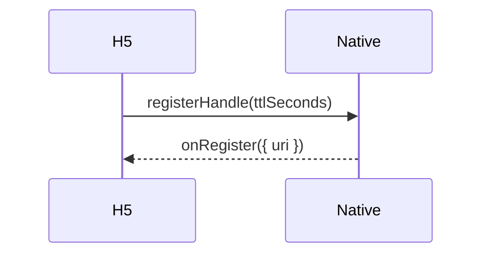
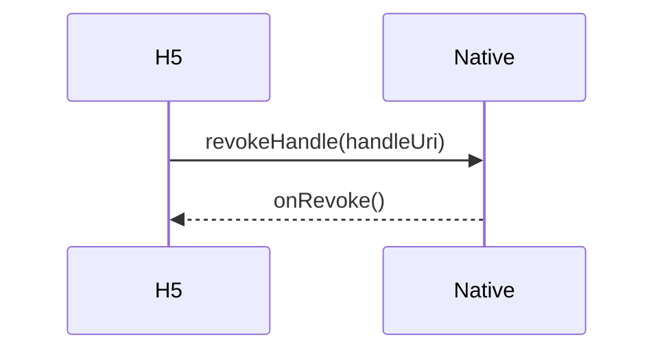
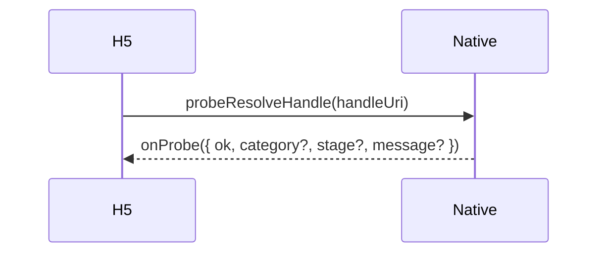
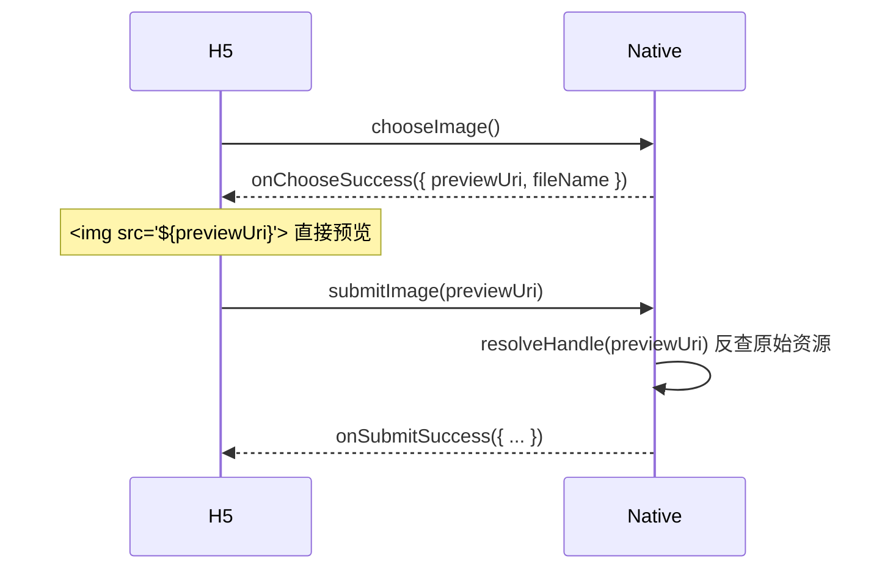

# LocalAsset Web 侧集成指南

本文档面向 **H5 / Web 前端开发者**，说明如何在 WebView 内嵌页面中使用 `local-asset://` 协议访问原生侧注册的资源。

Native 侧的接入方式（引擎构建、scheme 注册、桥接层配置）请参考各平台 README：

- [Android README](../android/README.md)
- [iOS README](../ios/README.md)
- [HarmonyOS README](../harmony/README.md)

## 目录

1. [URI 格式](#1-uri-格式)
   - [1.1 两种 URI 形态](#11-两种-uri-形态)
2. [在 HTML 中引用资源](#2-在-html-中引用资源)
   - [2.1 样式表](#21-样式表)
   - [2.2 脚本](#22-脚本)
   - [2.3 图片](#23-图片)
   - [2.4 Handle 资源（动态）](#24-handle-资源动态)
   - [2.5 fetch / XMLHttpRequest](#25-fetch--xmlhttprequest)
3. [缓存与缓存击穿](#3-缓存与缓存击穿)
   - [3.1 WebView 图片缓存问题](#31-webview-图片缓存问题)
   - [3.2 解决方案：`_la_cb` 缓存击穿参数](#32-解决方案_la_cb-缓存击穿参数)
   - [3.3 静态资源的缓存策略](#33-静态资源的缓存策略)
4. [错误处理](#4-错误处理)
   - [4.1 失败时的 Web 侧行为](#41-失败时的-web-侧行为)
   - [4.2 优雅降级模式](#42-优雅降级模式)
   - [4.3 四类错误与 Web 侧可见性](#43-四类错误与-web-侧可见性)
5. [JSBridge 交互模式](#5-jsbridge-交互模式)
   - [5.1 注册 Handle](#51-注册-handle)
   - [5.2 吊销 Handle](#52-吊销-handle)
   - [5.3 探测 Handle 状态](#53-探测-handle-状态)
   - [5.4 JSBridge 图片选择器（典型流程）](#54-jsbridge-图片选择器典型流程)
6. [跨平台 Web 侧差异](#6-跨平台-web-侧差异)
   - [6.1 scheme 注册时机](#61-scheme-注册时机)
   - [6.2 CORS 头差异](#62-cors-头差异)
   - [6.3 未拦截请求的回退](#63-未拦截请求的回退)
7. [完整示例](#7-完整示例)
   - [7.1 静态资源引用](#71-静态资源引用)
   - [7.2 Handle 生命周期管理](#72-handle-生命周期管理)
   - [7.3 JSBridge 选图 + 预览 + 提交](#73-jsbridge-选图--预览--提交)
   - [7.4 优雅降级](#74-优雅降级)
8. [速查表](#8-速查表)
9. [注意事项](#9-注意事项)

---

## 1. URI 格式

LocalAsset 使用自定义 scheme `local-asset://`，格式为：

```text
local-asset://<namespace>/<path>[?query][#fragment]
```

| 部分 | 说明 | 示例 |
|------|------|------|
| `namespace` | 资源命名空间，对应 host 位置 | `assets.demo.local` |
| `path` | 资源路径，以 `/` 开头 | `/static/styles.css` |
| `query` | 可选查询参数 | `?mode=dark` |
| `fragment` | 可选锚点 | `#section` |

### 1.1 两种 URI 形态

| 形态 | 格式 | 来源 |
|------|------|------|
| **静态映射 URI** | `local-asset://<host>/<path>` | Native 侧通过 resolver / registry 预注册，H5 侧直接引用 |
| **Handle URI** | `local-asset://handles/<token>/<fileName>` | Native 侧通过 `registerHandle()` 动态生成后，经 JSBridge 传给 H5 |

Handle URI 中的 `<token>` 是不透明的能力令牌——H5 不需要也不应该解析它，只需当作完整 URI 使用。

## 2. 在 HTML 中引用资源

`local-asset://` URI 可以用在任何接受 URL 的 HTML 上下文中，与 `https://` 用法完全一致：

### 2.1 样式表

```html
<link rel="stylesheet" href="local-asset://assets.demo.local/static/styles.css">
```

### 2.2 脚本

```html
<script src="local-asset://assets.demo.local/static/app.js"></script>
```

### 2.3 图片

```html

```

### 2.4 Handle 资源（动态）

Handle URI 由 Native 通过 JSBridge 传入，H5 侧动态拼接使用：

```javascript
// 假设 nativeBridge.registerHandle() 返回一个 handle URI
const handleUri = await nativeBridge.registerHandle(5); // TTL 5 秒
const img = document.createElement('img');
img.src = handleUri;
document.body.appendChild(img);
```

### 2.5 fetch / XMLHttpRequest

`local-asset://` 支持 `fetch()` 和 `XMLHttpRequest`，前提是 Native 侧已为 handler 配置 `allowedOrigins`（**默认不发 CORS 头**，见 §6.2）：把页面的 origin 加入 `allowedOrigins`，或放入 `"*"` 恢复通配：

```javascript
const response = await fetch('local-asset://assets.demo.local/static/data.json');
const data = await response.json();
```

> **HarmonyOS 注意**：ArkWeb 的 `WebSchemeHandler` 需要显式设置 `isSupportCORS: true` 和 `isSupportFetch: true`（默认已开启）。如果 fetch 返回网络错误，请检查 Native 侧的 scheme handler 配置与 `allowedOrigins`。

## 3. 缓存与缓存击穿

### 3.1 WebView 图片缓存问题

WebView（尤其 iOS WKWebView）会对相同 URL 的图片响应做内存缓存。对于 Handle URI，这意味着：

- 第一次加载 `local-asset://handles/<token>/photo.jpg` → 渲染成功
- Handle 过期或吊销后，再次加载同一 URL → **WKWebView 可能返回缓存的旧响应**，不会重新触发 scheme handler

### 3.2 解决方案：`_la_cb` 缓存击穿参数

LocalAsset 预留了专用查询参数 `_la_cb`，在 handle 查找时会被自动剥离——**不影响 handle 身份匹配，但让每次 URL 不同**：

```javascript
// 每次渲染都追加一个变化的 _la_cb 值，强制 WebView 重新请求
const src = `${handleUri}?_la_cb=${Date.now()}`;
img.src = src;
```

这样即使 handle 已过期或吊销，WebView 也会重新发起请求，scheme handler 会正确返回 404，触发 `error` 事件。

> **关键**：`_la_cb` 是跨平台保留参数名（`HandleRegistry.CACHE_BUST_PARAM`）。**非 `_la_cb` 的查询参数会参与 handle 身份匹配**——如果 handle URI 附带了其他 query 参数，它们必须与注册时一致，否则 lookup miss。

### 3.3 静态资源的缓存策略

Native 侧 `ResourceCachePolicy` 根据资源类型设置缓存头：

| 资源类型 | Cache-Control | ETag |
|---------|---------------|------|
| STATIC + Bytes | `public, max-age=86400`（默认 24h，可自定义） | `"<id>-<size>"` |
| STATIC + FilePath | `public, max-age=86400` | `"<id>-<mtime>"` |
| DYNAMIC + 任意来源 | `no-store` | `"<id>-<size>"` 或 weak ETag |

H5 侧无需额外处理——WebView 会根据这些头自行管理缓存。如果需要强制刷新静态资源，追加 `_la_cb` 参数即可。

## 4. 错误处理

### 4.1 失败时的 Web 侧行为

当 `local-asset://` 请求失败时，Native 桥接层返回 **HTTP 404 + 空 body**。在 H5 侧表现为：

| 资源类型 | 失败表现 |
|---------|---------|
| `` | 触发 `error` 事件，显示 broken image |
| `<link>` / `<script>` | 触发 `error` 事件，资源不生效 |
| `fetch()` | Promise resolve，`response.ok === false`，`response.status === 404` |

### 4.2 优雅降级模式

对于可能缺失的资源，H5 侧应监听 `error` 事件做降级处理，保证页面不崩溃：

```html


<script>
const img = document.getElementById('avatar');
img.addEventListener('error', () => {
  // 降级：替换为占位图或隐藏
  img.style.display = 'none';
  console.log('头像资源不可用，已降级');
});
</script>
```

对于可能过期的 Handle URI，每次渲染都应追加 `_la_cb` 参数，并在 `error` 事件中处理过期/吊销场景：

```javascript
function renderHandle(handleUri) {
  const img = document.createElement('img');
  img.src = `${handleUri}?_la_cb=${Date.now()}`;
  img.addEventListener('load', () => console.log('handle 渲染成功'));
  img.addEventListener('error', () => console.log('handle 已过期或被吊销'));
  return img;
}
```

### 4.3 四类错误与 Web 侧可见性

LocalAsset 内部将错误分为四类，但 **WebView 拦截层只返回 404**，H5 侧无法直接看到错误分类。如果需要错误分类信息，需通过 JSBridge 让 Native 调用 `engine.resolve()` 捕获 `ResourceException` 后回传：

| 错误类别 | 含义 | 触发场景 |
|---------|------|---------|
| `PARSE_ERROR` | URL 解析失败 | scheme 不合法、缺少 namespace |
| `RESOLUTION_ERROR` | 资源未找到或已过期 | 无 resolver 命中、handle 已过期/吊销 |
| `LOAD_ERROR` | 资源加载失败 | 文件不存在、读取异常 |
| `SECURITY_ERROR` | 安全策略拒绝 | 路径穿越、scope 不匹配、文件根越界 |

```javascript
// 通过 JSBridge 请求 Native 探测错误详情
const result = await nativeBridge.probeResolve('local-asset://security.demo.local/engine-mismatch');
// result = { ok: false, category: 'SECURITY_ERROR', stage: 'policy_post', message: '...' }
```

## 5. JSBridge 交互模式

LocalAsset 的 Handle 路径需要 H5 与 Native 通过 JSBridge 协作。以下是典型的交互模式：

### 5.1 注册 Handle



H5 侧：

```javascript
// 注册按钮点击
document.getElementById('registerBtn').addEventListener('click', () => {
  nativeBridge.registerHandle(5); // TTL 5 秒
});

// Native 回调
window.LocalAssetSampleNative = {
  onRegister(payload) {
    const handleUri = payload.uri;
    // 渲染
    const img = document.createElement('img');
    img.src = `${handleUri}?_la_cb=${Date.now()}`;
    // ...
  }
};
```

### 5.2 吊销 Handle



### 5.3 探测 Handle 状态



### 5.4 JSBridge 图片选择器（典型流程）

这是最常见的 Handle 使用场景——Web 端触发原生选图，拿到 previewUri 预览，再提交回原生：



关键点：`previewUri` 是一个 `local-asset://handles/...` URI，H5 侧直接当图片 URL 用即可。提交时把同一个 URI 传回 Native，Native 通过 `resolveHandle()` 反查到原始资源。

## 6. 跨平台 Web 侧差异

### 6.1 scheme 注册时机

| 平台 | 约束 |
|------|------|
| Android | `shouldInterceptRequest` 可随时挂载，无时机约束 |
| iOS | `WKURLSchemeHandler` 必须在 `WKWebView` 创建前注册到 `WKWebViewConfiguration`，创建后不可更改 |
| HarmonyOS | `WebSchemeHandler` 在 `Web` 组件创建时注册 |

这是 Native 侧约束，但 H5 开发者需理解：如果 `local-asset://` 请求返回网络错误而非 404，可能是 Native 侧未注册 scheme（而非资源不存在）。

### 6.2 CORS 头差异

三端默认**不发送任何 CORS 头**（`Access-Control-Allow-Origin` 缺省）。`` / `<link>` / `<script>` / `<video>` 不经 CORS 检查，默认即能引用 `local-asset://` 子资源；只有 `fetch()` / `XMLHttpRequest` 需要 CORS 头，而这些调用方知道自己的 origin，故 CORS 改为**显式放行**模型：集成方在 handler 上传 `allowedOrigins`（Android `LocalAssetWebViewClient(allowedOrigins=…)`、iOS `LocalAssetSchemeHandler(allowedOrigins:…)`、HarmonyOS `LocalAssetSchemeHandler({allowedOrigins:…})`），请求的 `Origin` 命中列表则回显该 origin 并附 `Vary: Origin`；列表含 `"*"` 则恢复通配 `Access-Control-Allow-Origin: *`。

这一默认收紧的原因：Handle 路径是能力令牌模型（`design.md` §5.4），token 即授权，而 URL 路径会经 `document.referrer`、出站 `Referer`、`performance.getEntriesByType('resource')` 泄漏——通配 CORS 会把任何泄漏直接变成可读字节。

失败响应（404）的 CORS 头三端一致：默认同样不发；设置了 `allowedOrigins` 时按同样规则回显，让 H5 侧能读到 404 状态码。

> **iOS 影响**：如果 H5 页面与 `local-asset://` 不同源且未配置 `allowedOrigins`，在 iOS 上 fetch 失败的请求可能表现为 opaque network error（`fetch().catch()` 而非 `response.status === 404`）。`` / `<link>` / `<script>` 的 `error` 事件不受此影响。

### 6.3 未拦截请求的回退

当 `local-asset://` 请求未被 LocalAsset 引擎拦截时（如 scheme 未注册）：

| 平台 | 行为 |
|------|------|
| Android | `shouldInterceptRequest` 返回 `null` → WebView 尝试默认加载（通常失败） |
| iOS | `WKURLSchemeHandler` 必须完成 task → 返回 404 |
| HarmonyOS | `onRequestStart` 返回 `false` → 交还内核处理 |

对 H5 侧的影响：Android 上未拦截的请求可能表现为超时或网络错误，iOS 和 HarmonyOS 上表现为 404。

## 7. 完整示例

### 7.1 静态资源引用

```html
<!DOCTYPE html>
<html>
<head>
  <link rel="stylesheet" href="local-asset://assets.demo.local/static/styles.css">
</head>
<body>
  
  <script src="local-asset://assets.demo.local/static/app.js"></script>
</body>
</html>
```

### 7.2 Handle 生命周期管理

```javascript
let handleUri = null;

// 注册
document.getElementById('register').addEventListener('click', () => {
  NativeBridge.registerHandle(30); // TTL 30s
});

window.onLocalAssetNative = {
  onRegister(payload) {
    handleUri = payload.uri;
    renderHandle();
    startCountdown(30);
  },
  onRevoke() {
    handleUri = null;
    console.log('handle 已吊销');
  }
};

function renderHandle() {
  if (!handleUri) return;
  const img = document.getElementById('preview');
  img.src = `${handleUri}?_la_cb=${Date.now()}`; // 缓存击穿
  img.onerror = () => console.log('handle 已过期或被吊销');
}

function startCountdown(seconds) {
  const expireAt = Date.now() + seconds * 1000;
  const timer = setInterval(() => {
    const remain = Math.max(0, Math.round((expireAt - Date.now()) / 1000));
    console.log(`TTL: ${remain}s`);
    if (remain <= 0) {
      clearInterval(timer);
      renderHandle(); // 过期后 re-fetch 验证失效
    }
  }, 1000);
}
```

### 7.3 JSBridge 选图 + 预览 + 提交

```javascript
// 1. 触发选图
document.getElementById('choose').addEventListener('click', () => {
  NativeBridge.chooseImage();
});

// 2. 收到 previewUri 后预览
window.onChooseSuccess = (payload) => {
  const { previewUri, fileName } = payload;
  document.getElementById('preview').src = previewUri;
  // 保存 uri 供提交使用
  window.currentPreviewUri = previewUri;
};

// 3. 提交时把 previewUri 传回 Native
document.getElementById('submit').addEventListener('click', () => {
  NativeBridge.submitImage(window.currentPreviewUri);
});

window.onSubmitSuccess = (payload) => {
  console.log('提交成功', payload);
};
```

### 7.4 优雅降级

```html
<div id="gallery"></div>
<script>
const resources = [
  { name: '有效资源', url: 'local-asset://resilient.demo.local/static/logo.svg' },
  { name: '缺失资源', url: 'local-asset://resilient.demo.local/static/missing.svg' },
];

const gallery = document.getElementById('gallery');
resources.forEach(({ name, url }) => {
  const img = document.createElement('img');
  img.src = url;
  img.onload = () => console.log(`${name}: 已加载`);
  img.onerror = () => {
    console.log(`${name}: 降级`);
    img.alt = name;
    img.style.opacity = '0.3';
  };
  gallery.appendChild(img);
});
</script>
```

## 8. 速查表

| 场景 | URI 形态 | H5 侧做法 |
|------|---------|----------|
| 引用静态资源 | `local-asset://<host>/<path>` | 直接写在 `src` / `href` 中 |
| 引用动态 handle | `local-asset://handles/<token>/<file>` | 从 JSBridge 获取 URI 后动态设置 `src` |
| 缓存击穿 | `${uri}?_la_cb=${Date.now()}` | 追加 `_la_cb` 参数，每次值不同 |
| 错误降级 | 监听 `error` 事件 | `img.addEventListener('error', ...)` |
| fetch 请求 | `fetch('local-asset://...')` | 需先在 handler 配置 `allowedOrigins`（默认不发 CORS 头） |
| 获取错误详情 | JSBridge 调 Native `engine.resolve()` | Native 回传 `category + stage` |

## 9. 注意事项

1. **不要硬编码 Handle URI**：Handle URI 包含不透明 token，必须从 Native 通过 JSBridge 动态获取。硬编码的 URI 在进程重启后会失效（token 不可复现）。
2. **`_la_cb` 是唯一的保留参数**：不要将 `_la_cb` 用作业务参数。其他查询参数（如 `?mode=dark`）会参与 handle 身份匹配——如果注册时 URI 不含该参数，查找时附带会导致 miss。
3. **Handle 有 TTL**：注册时设置的 TTL 到期后 URI 自动失效。如果需要长期可用的资源，使用 Registry 路径（`register(ResourceDescriptor)`）而非 Handle 路径。
4. **404 不区分错误类型**：H5 侧的 404 可能来自 RESOLUTION_ERROR（资源不存在/过期）或 SECURITY_ERROR（权限不足）。如需区分，通过 JSBridge 请求 Native 探测。
5. **同源策略**：`local-asset://` 是自定义 scheme，与 `https://` 页面不同源。跨源 fetch 需要 Native 侧配置 `allowedOrigins` 才会返回 CORS 头（默认不发）。`` / `<link>` / `<script>` 不受同源策略约束。
6. **未配置 `allowedOrigins` 时跨源 fetch 拿不到响应体**：跨源 fetch 在未放行时可能收到 opaque error 而非可读状态码。如需在 H5 侧判断 404，建议通过 JSBridge 走 Native `engine.resolve()` 路径。
