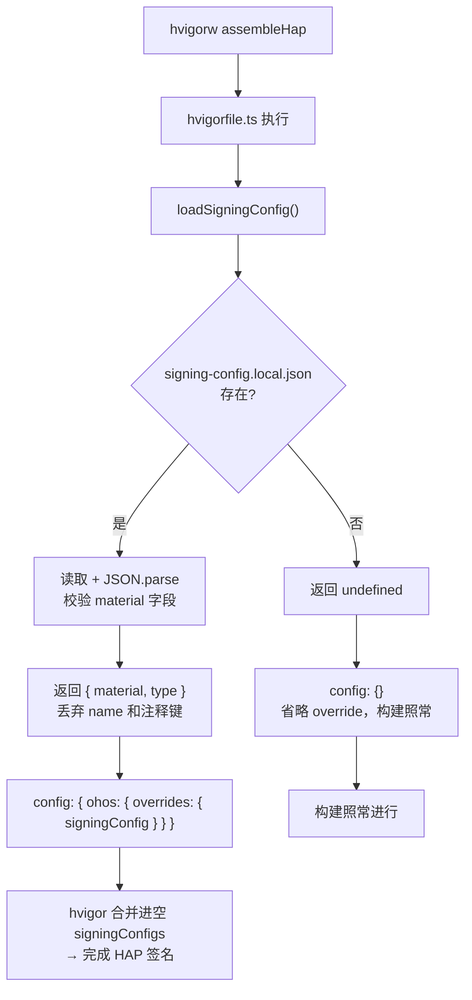

# 签名配置与加载机制

## 目录

1. [问题背景](#1-问题背景)
2. [解决方案](#2-解决方案)
   - [2.1 涉及文件一览](#21-涉及文件一览)
   - [2.2 构建期注入流程](#22-构建期注入流程)
   - [2.3 override schema 约束](#23-override-schema-约束)
3. [首次配置步骤](#3-首次配置步骤)
   - [3.1 DevEco Studio 自动签名（推荐）](#31-deveco-studio-自动签名推荐)
   - [3.2 手动填写](#32-手动填写)
4. [文件缺失时的行为](#4-文件缺失时的行为)
   - [4.1 文件存在但格式有误](#41-文件存在但格式有误)
5. [误删恢复](#5-误删恢复)

## 1. 问题背景

DevEco Studio 在首次运行/调试时会**自动**把签名配置回写进 `build-profile.json5`。这份配置是机器相关且含密钥口令的：

- `certpath` / `profile` / `storeFile` 指向 `~/.ohos/config/...` 的绝对路径，换台机器就不存在，clone 下来直接构建失败；
- `keyPassword` / `storePassword` 是能解开 `.p12` 的口令，进了 git 历史就删不干净。

但整个 `build-profile.json5` 又不能 gitignore —— `modules`（三个模块的声明）与 `products`（SDK 版本、strictMode）是全团队必须一致的工程结构，缺了 hvigor 不知道要构建什么。

## 2. 解决方案

只把**因人而异的那一段**外置：`build-profile.json5` 的 `signingConfigs` 在提交版本里保持 `[]`，实际签名材料放进 gitignore 的 `signing-config.local.json`，由 `hvigorfile.ts` 在构建期注入。

### 2.1 涉及文件一览

| 文件 | 作用 | 是否进仓库 |
|---|---|---|
| `build-profile.json5` | 工程结构（modules / products / buildModeSet），`signingConfigs` 恒为 `[]` | ✅ 是 |
| `signing-config.local.json` | 本机签名材料（证书路径、密钥口令等） | ❌ 否（`.gitignore` 忽略） |
| `signing-config.local.json.template` | 签名配置模板，供新成员复制填写 | ✅ 是 |
| `hvigorfile.ts` | 构建期读取 `signing-config.local.json`，通过 `config.ohos.overrides.signingConfig` 注入 | ✅ 是 |
| `.gitignore` | 第 28 行忽略 `signing-config.local.json` | ✅ 是 |

### 2.2 构建期注入流程



### 2.3 override schema 约束

`config.ohos.overrides.signingConfig` 只接受 `material` 与 `type` 两个字段。多带 `name` 会导致构建以 `Schema validate failed ... propertyName: 'name'` 失败。`name` 的职责由 `build-profile.json5` 的 `products[].signingConfig` 引用名承担（默认为 `default`），而那份配置正是本机制要摘掉的，所以 `loadSigningConfig()` 只提取 `material` 和 `type`，模板中的 `//` 注释键与 `name` 一并丢弃。

## 3. 首次配置步骤

### 3.1 DevEco Studio 自动签名（推荐）

1. 用 DevEco Studio 打开 `harmony/` 工程。
2. **File > Project Structure > Signing Configs**，勾选自动签名（Automatically generate signature）。
3. DevEco 会把签名配置写进 `build-profile.json5` 的 `signingConfigs` 数组。
4. 把 `signingConfigs[0]` 整段**剪切**到 `signing-config.local.json`（参照模板格式）。
5. 将 `build-profile.json5` 的 `signingConfigs` 恢复为 `[]`。
6. 确认 `signing-config.local.json` 不出现在 `git status` 中（被 `.gitignore` 忽略）。

### 3.2 手动填写

```bash
cp harmony/signing-config.local.json.template harmony/signing-config.local.json
```

然后编辑 `signing-config.local.json`，填入本机实际值：

```json
{
  "name": "default",
  "type": "HarmonyOS",
  "material": {
    "certpath": "/Users/<你的用户名>/.ohos/config/xxx.cer",
    "keyAlias": "debugKey",
    "keyPassword": "DevEco 生成的密文口令",
    "profile": "/Users/<你的用户名>/.ohos/config/xxx.p7b",
    "signAlg": "SHA256withECDSA",
    "storeFile": "/Users/<你的用户名>/.ohos/config/xxx.p12",
    "storePassword": "DevEco 生成的密文口令"
  }
}
```

> `name` 字段必须与 `build-profile.json5` 中 `products[].signingConfig` 引用的名字一致，默认为 `default`。`name` 不会被 `loadSigningConfig()` 读取（override schema 不接受它），但保留在文件中作为人类可读的参照。

## 4. 文件缺失时的行为

`signing-config.local.json` 不存在时，`loadSigningConfig()` 返回 `undefined`，整个 `config.ohos.overrides` 省略，构建照常进行：

| 命令 | 是否需要签名 | 文件缺失时 |
|---|---|---|
| `hvigorw test` | ❌ | 正常通过 |
| `hvigorw assembleHar` | ❌ | 正常通过 |
| `hvigorw assembleHap` | ✅ | 失败，提示签名缺失 |

刻意不在缺失时抛错：让只想跑测试的贡献者无需准备任何签名材料。

### 4.1 文件存在但格式有误

- JSON 语法错误 → `loadSigningConfig()` 抛 `signing-config.local.json 解析失败：<详情>`，避免让人对着"签名缺失"的报错去查签名本身。
- 缺少 `material` 字段 → 抛 `signing-config.local.json 缺少 material 字段，参照 signing-config.local.json.template 填写。`

## 5. 误删恢复

`signing-config.local.json` 被 `.gitignore` 忽略，不进 git 历史，无法通过 `git checkout` 恢复。但如果 DevEco Studio 曾经自动签名过，签名配置会残留在 `build-profile.json5` 的 `signingConfigs` 中（未被摘除的情况下）。恢复方法：

1. 检查 `build-profile.json5` 的 `signingConfigs` 是否非空。
2. 若非空，将 `signingConfigs[0]` 剪切到 `signing-config.local.json`。
3. 将 `signingConfigs` 恢复为 `[]`。
4. 若 `signingConfigs` 已为 `[]`（已摘除且文件丢失），则需在 DevEco Studio 中重新执行自动签名，再按[首次配置步骤](#3-首次配置步骤)操作。
